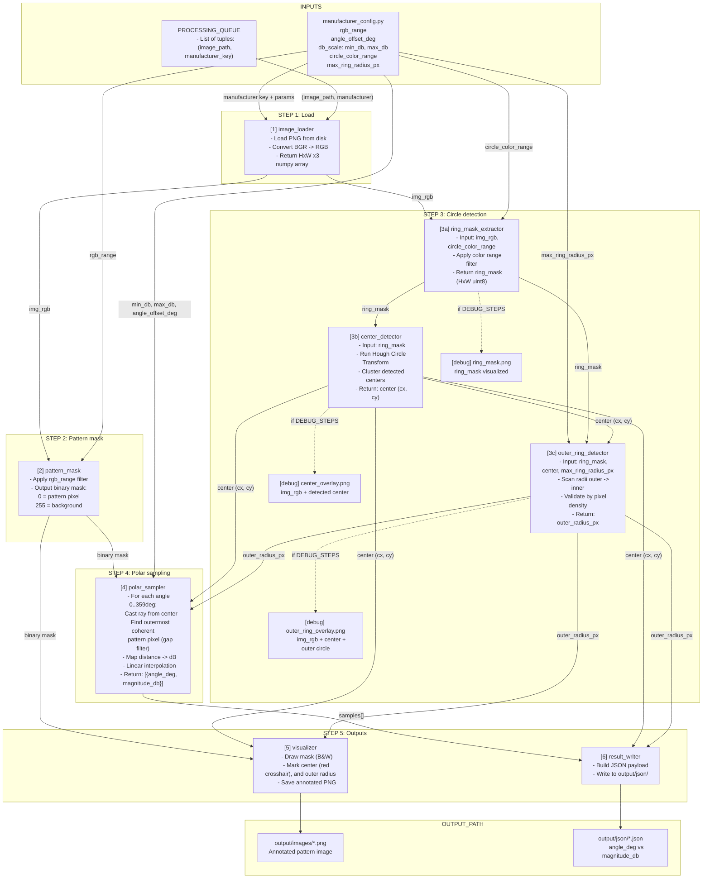

# Radiation Pattern Extraction — Architecture

## Overview

The system reads radiation pattern images from antenna datasheets,
extracts the 2D polar pattern shape, calibrates it against known dB
scale anchors, and outputs structured JSON data (angle vs magnitude).

Each image is processed independently. All manufacturer-specific
parameters are centralized in `config/manufacturer_config.py`.
Adding a new manufacturer requires only changes to that file.

---

## Data Flow



---

## Key Design Decisions

`manufacturer_config.py` is the only place that changes when adding a
manufacturer.

The dB scale is purely linear between two anchors:
- `distance = 0` maps to `min_db`
- `distance = outer_radius_px` maps to `max_db`


**`outer_radius_px` comes from circle detection, not from the pattern.**
The pattern shape rarely reaches the outermost ring. Using the pattern
extent to estimate scale would produce systematic dB errors. The
concentric rings in the image are the calibration ground truth.


---

## Directory Structure
```
pattern_extractor/
    main.py
    config/
        __init__.py
        manufacturer_config.py
    modules/
        __init__.py
        image_loader.py
        pattern_mask.py
        ring_mask_extractor.py
        center_detector.py
        outer_ring_detector.py
        polar_sampler.py
        visualizer.py
        result_writer.py
    datasheets/
        taoglas-1.png
        taoglas-2.png
        rf-elements-1.png
        molex-1.png
        alpha-wireless-1.png
        quectel-1.png
    output/
        images/
        json/
        debug/
            ring_mask/
            center_overlay/
            outer_ring_overlay/
    docs/
        ARCHITECTURE.md
        MODULES_DETAIL.md
```