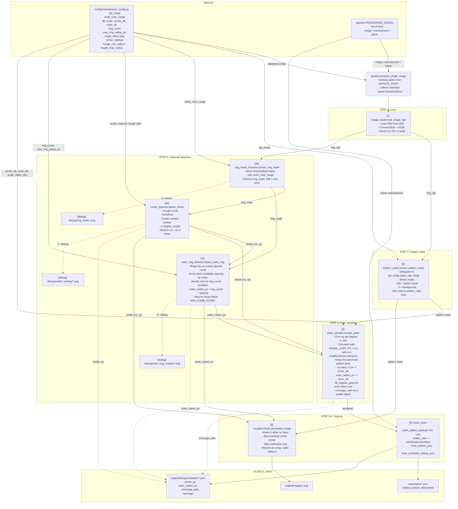

# Radiation Pattern Extraction — Architecture

## Overview

The service reads radiation pattern images from antenna datasheets, extracts the
2D polar pattern shape, calibrates it against the plot's own graticule, and
emits structured JSON in the unified contract from
[`docs/data-schema.md`](../../../docs/data-schema.md).

Each image is processed independently. All manufacturer-specific parameters are
centralized in `config/manufacturer_config.py`; adding a manufacturer requires
changes to that file only.

`main.py` is an argparse shell. `pipeline.py` is the orchestrator: it holds
`PROCESSING_QUEUE`, resolves paths from `SERVICE_ROOT`, drives the six steps,
and is the only place that isolates per-image failures so one bad datasheet does
not abort a run.

---

## Data Flow



---

## Key Design Decisions

### The mask convention is `255` = feature

Every binary mask in the service uses `255` for the feature and `0` for the
background, and all thresholding runs through `modules/rgb_range.py`. This was
once split across two modules with opposite conventions, which inverted the
polar sampler silently — the pipeline still ran, it just produced wrong numbers.
One helper, one convention.

### The dB scale is linear between two anchors

- `distance = 0 px` maps to `center_db`
- `distance = outer_radius_px` maps to `outer_db`

Implemented with a single `np.interp`, which **clamps** rather than
extrapolates: a trace that overshoots the outer ring saturates at `outer_db`
instead of reporting a value that is not on the plot's scale.

The keys are named `center_db` / `outer_db` rather than `min_db` / `max_db`
because the earlier names carried opposite meanings in different configs — the
same key meant "value at the center" in four entries and "value at the outer
ring" in a fifth, silently inverting four of the five calibrations.

### `outer_radius_px` comes from the graticule, not from the pattern

The pattern shape rarely reaches the outermost ring. Estimating scale from the
pattern's own extent would produce systematic dB errors that look plausible. The
concentric rings are the calibration ground truth.

### Step 3c fits a comb instead of scanning for the outermost ring

The original approach scanned radii outward and accepted the first one whose
pixel density passed a threshold. That fails on these images: the graticule is
one anti-aliased pixel wide, inner rings are often denser than the outer one, so
the scan returned the *densest* radius rather than the outermost.

Because the rings are evenly spaced, the radial density profile is a periodic
comb. The detector therefore scores each candidate spacing by the mean density
across all `ring_count` multiples and takes the best-scoring spacing. A single
sparse arc cannot outscore a full set of rings, which is what makes the fit
robust.

Its known failure mode: a graticule that also draws *radial spokes* in the ring
colour is roughly uniformly dense at every radius, so the comb score barely
varies and the fit collapses to `MIN_RING_PERIOD_PX`. See the molex entry in
the [README](../README.md#known-limitations).

### `ring_count` is declared, not detected

It is read straight off the plot's radial dB labels, where it is unambiguous.
Inferring it from pixels would mean detecting how many rings exist — the same
problem the comb fit is trying to solve, and the reason the fit can be
constrained at all. Declaring it turns an under-determined search into a
one-parameter one.

### Ray walking is sub-pixel and slightly tolerant

The plotted trace is one anti-aliased pixel wide, so a ray stepping 1 px at a
time along a diagonal walks straight past it. Measured across the datasheets,
integer stepping with no tolerance found the trace on only 54–72% of rays for
three of five manufacturers. `RADIAL_STEP_PX = 0.5` plus a 4-neighbourhood
tolerance raises that to 81–100%, at a cost of up to 1 px of radial slack — well
inside the dB resolution of a rasterized plot.

### Pixel artifacts stay out of the contract

`center_px`, `outer_radius_px` and `coverage_ratio` are calibration artifacts,
not pattern data. They go to `output/debug/extraction/*.json` in snake_case.
`modules/result_writer.py` is the single camelCase boundary in the service.

---

## Directory Structure

```
python/reconstruction-service/
    main.py                     argparse CLI entry point
    pipeline.py                 orchestrator: queue, steps, error isolation
    pytest.ini
    requirements.txt            runtime deps (opencv-python, numpy)
    requirements-dev.txt        adds pytest
    CLAUDE.md
    README.md
    config/
        __init__.py
        manufacturer_config.py  all per-manufacturer tuning + validation
    modules/
        __init__.py
        rgb_range.py            shared thresholding, 255 = feature
        image_loader.py         [1]
        pattern_mask.py         [2]
        ring_mask_extractor.py  [3a]
        center_detector.py      [3b]
        outer_ring_detector.py  [3c]
        polar_sampler.py        [4]
        visualizer.py           [5]
        result_writer.py        [6]
    utils/
        __init__.py
        file_utils.py           currently unused
    tests/
        conftest.py             synthetic numpy fixtures
        test_rgb_range.py
        test_pattern_mask.py
        test_image_loader.py
        test_manufacturer_config.py
        test_detectors.py
        test_polar_sampler.py
        test_result_writer.py
        test_pipeline_integration.py
    algorithms-tests/
        legacy_extractor.py     superseded reference; old inverted polarity
    datasheets/
        taoglas-1.png
        rf-elements-1.png
        molex-1.png
        alpha-wireless-1.png
        quectel-1.png
    output/                     gitignored
        images/
        json/
        debug/
            extraction/
            ring_mask/
            center_overlay/
            outer_ring_overlay/
    docs/
        ARCHITECTURE.md
        MODULES_DETAIL.md       still empty
```
